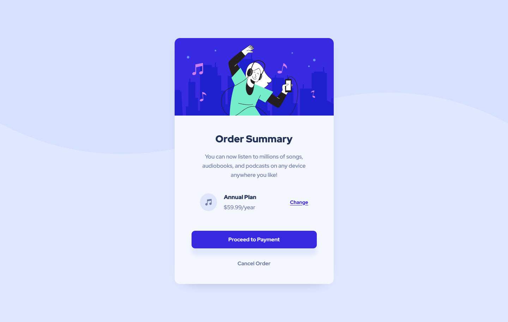

# Frontend Mentor - Order summary card solution

This is a solution to the [Order summary card challenge on Frontend Mentor](https://www.frontendmentor.io/challenges/order-summary-component-QlPmajDUj). 

### Screenshot

### Links

- Solution URL: [Solution URL here](https://www.frontendmentor.io/solutions/order-summary-component-G1VDziUsQp)
- Live Site URL: [Live site URL here](https://tuhin-jr.github.io/Frontend-Mentor---Order-summary-card-solution/)

### Built with

- Semantic HTML5 markup
- CSS custom properties
- Flexbox

## Author

- Frontend Mentor - [@Tuhin-jr](https://www.frontendmentor.io/profile/Tuhin-jr)
